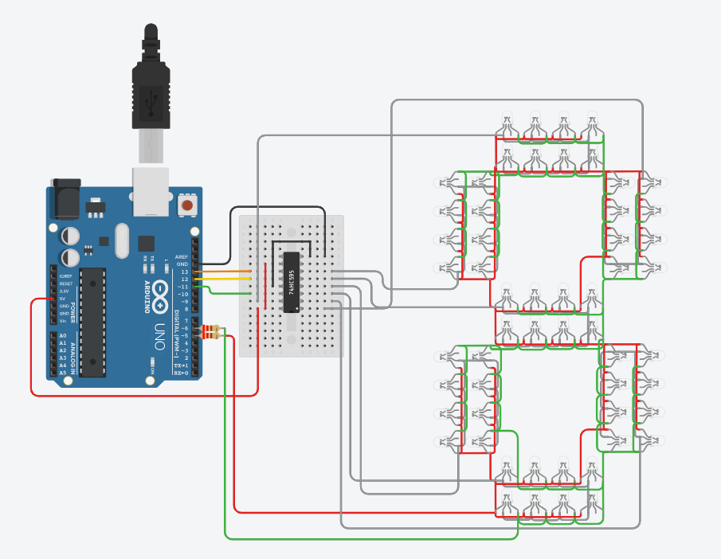

# Traffic Light Single-Digit Countdown Timer 🚦

## Overview
This project simulates a traffic light system with a **single-digit countdown timer** using an Arduino Uno R3 in Tinkercad. It cycles through the standard traffic light phases: **GO (Green)**, **READY (Yellow)**, and **STOP (Red)**, each with a defined duration and a visible countdown.

## Features
- **GO (Green)**: 7-second duration
- **READY (Yellow)**: 3-second duration
- **STOP (Red)**: 9-second duration
- Countdown displayed using shift registers and LEDs
- Fully implemented in Tinkercad Electronics Lab

## Circuit View


## Components Used
- Arduino Uno R3
- LEDs (Red, Yellow, Green)
- Resistors
- Breadboard
- Shift Register (for countdown display)
- Supporting wiring and connections

## Code Highlights
```cpp
void loop() {
  STOP();
  GO();
  READY();
}

// Go (Green) signal with 7 sec duration
void GO() {
  int g = 7;
  analogWrite(green, 255);
  analogWrite(red, 0);
  for (int i = g - 1; i >= 0; i--) {
    digitalWrite(lth, 0);
    shiftOut(dat, clk, LSBFIRST, invbit[i]);
    digitalWrite(lth, 1);
    delay(1000);
  }
}

// Ready (Yellow) signal with 3 sec duration
void READY() {
  int r = 3; // duration
  analogWrite(red, 255);
  analogWrite(green, 255);
  for(int i=r-1; i>=0; i--) {
    digitalWrite(lth, 0);
    shiftOut(dat, clk, LSBFIRST, invbit[i]);
    digitalWrite(lth, 1);
    delay(1000);
  }
}

// Stop (Red) signal with 9 sec duration
void STOP() {
  int s = 9; // duration
  analogWrite(red, 255);
  analogWrite(green, 0);
  for(int i=s-1; i>=0; i--) {
    digitalWrite(lth, 0);
    shiftOut(dat, clk, LSBFIRST, invbit[i]);
    digitalWrite(lth, 1);
    delay(1000);
  }
}
```

- **GO()**: Activates green LED for 7 seconds with countdown.
- **READY()**: Activates yellow LED for 3 seconds with countdown.
- **STOP()**: Activates red LED for 9 seconds with countdown.

## How to Run
1. Open the project in [Tinkercad](https://www.tinkercad.com/things/7lTU2Bqy6s6-traffic-light-single-digit-countdown-timer/editel?returnTo=https%3A%2F%2Fwww.tinkercad.com%2Fdashboard%2Fdesigns%2Fall).
2. Click **Start Simulation**.
3. Observe the traffic light cycle and countdown timer in action.

## Applications
- Educational demonstration of traffic light logic
- Introductory project for Arduino programming
- Simulation of real-world embedded systems timing

---
✨ *Experiment with durations or add more digits to extend the countdown functionality!*